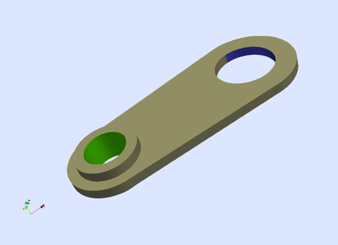
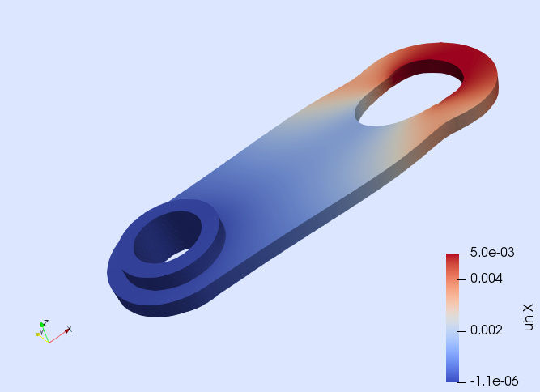

<!--This file was generated, do not modify it.-->
## Problem statement

We want to solve a linear elasticity problem defined on the 3D domain depicted in next figure.



We impose the following boundary conditions. All components of the displacement vector are constrained to zero on the surface $\Gamma_{\rm G}$, which is marked in green in the figure. On the other hand, the first component of the displacement vector is prescribed to the value $\delta\doteq 5$mm on the surface $\Gamma_{\rm B}$, which is marked in blue. No body or surface forces are included in this example. Formally, the PDE to solve is

$$
\left\lbrace
\begin{aligned}
-∇\cdot\sigma(u) = 0 \ &\text{ in } \ \Omega,\\
u = 0 \ &\text{ on }\ \Gamma_{\rm G},\\
u_1 = \delta \ &\text{ on }\ \Gamma_{\rm B},\\
\sigma(u)\cdot n = 0 \ &\text{ on }\  \Gamma_{\rm N}.\\
\end{aligned}
\right.
$$

The variable $u$ stands for the unknown displacement vector, the vector $n$ is the unit outward normal to the Neumann boundary $\Gamma_{\rm N}\doteq\partial\Omega\setminus\left(\Gamma_{\rm B}\cup\Gamma_{\rm G}\right)$ and $\sigma(u)$ is the stress tensor defined as
$$
\sigma(u) \doteq \lambda\ {\rm tr}(\varepsilon(u)) \ I +2 \mu \  \varepsilon(u),
$$
where $I$ is the 2nd order identity tensor, and $\lambda$ and $\mu$ are the *Lamé parameters* of the material. The operator $\varepsilon(u)\doteq\frac{1}{2}\left(\nabla u + (\nabla u)^T \right)$ is the symmetric gradient operator (i.e., the strain tensor). Here, we consider material parameters corresponding to aluminum with Young's modulus $E=70\cdot 10^9$ Pa and Poisson's ratio $\nu=0.33$. From these values, the Lamé parameters are obtained as $\lambda = (E\nu)/((1+\nu)(1-2\nu))$ and $\mu=E/(2(1+\nu))$.

## Numerical scheme

We use a conventional Galerkin FE method with conforming Lagrangian FE spaces. For this formulation, the weak form is: find $u\in U$ such that $ a(u,v) = 0 $ for all $v\in V_0$, where $U$ is the subset of functions in $V\doteq[H^1(\Omega)]^3$ that fulfill the Dirichlet boundary conditions of the problem, whereas $V_0$ are functions in $V$ fulfilling $v=0$ on $\Gamma_{\rm G}$ and $v_1=0$ on $\Gamma_{\rm B}$. The bilinear form of the problem is
$$
a(u,v)\doteq \int_{\Omega} \varepsilon(v) : \sigma(u) \ {\rm d}\Omega.
$$

## Load and inspect the discrete model

On top of it's mesh-generation functionalities, Gridap provides a convenient ways to read and write discrete models from and to files. We import the model for this problem from `GMSH` as follows:

````julia:ex1
using Gridap, GridapGmsh
using DrWatson

msh_file_gmsh = projectdir("meshes/elasticity.msh")
model = GmshDiscreteModel(msh_file_gmsh)
````

This model contains the mesh and the physical tags of the model, which have been created directly through `GMSH`. Another option would be to create the model using Gridap, then exporting to `.json` format in the followig way:

````julia:ex2
msh_file_json = projectdir("meshes/elasticity.json")
to_json_file(model,msh_file_json)
````

We can then load the saved model

````julia:ex3
model = DiscreteModelFromFile(msh_file_json)
````

You can easily inspect the generated discrete model in [Paraview](https://www.paraview.org/) by writing it in `vtk` format.

````julia:ex4
writevtk(model,datadir("elasticity_model"))
````

The previous line generates four different files `model_0.vtu`, `model_1.vtu`, `model_2.vtu`, and `model_3.vtu` containing the vertices, edges, faces, and cells present in the discrete model. Moreover, you can easily inspect which boundaries are defined within the model.

### Exercise 1

_Open the resulting files with Paraview. Visualize the faces of the model and color them by each of the available fields. Identify the field names representing the boundaries $\Gamma_{\rm B}$ and $\Gamma_{\rm G}$._

## Set up the vector-valued FE space with Dirichlet BCs in selected components

We will construct the vector-valued test FE space as follows:

```julia
order = 1
reffe = ReferenceFE(lagrangian,VectorValue{3,Float64},order)
V0 = TestFESpace(model,reffe;
 conformity=:H1,
 dirichlet_tags=dirichlet_tags,
 dirichlet_masks=dirichlet_masks)
```

The vector-valued interpolation is selected via the option `valuetype=VectorValue{3,Float64}`, where we use the type `VectorValue{3,Float64}`, which is the way Gridap represents vectors of three `Float64` components.

In the next two exercises, we will fill in
  1. the `dirichlet_tags` optional argument to identify the Dirichlet regions, and
  2. the `dirichlet_masks` optional argument to specify which components of the displacement are constrained.

Let's go step-by-step.

### Exercise 2

_Fill in the `dirichlet_tags` using the tag names identified in **Exercise 2** for $\Gamma_{\rm B}$ and $\Gamma_{\rm G}$._

**Hint:** The general input format of `dirichlet_tags` is a one-dimensional array of tag name strings `["tag_name_1",...,"tag_name_n"]`.

````julia:ex5
# Solution for exercise 2
````

### Exercise 3

_Fill in the `dirichlet_masks` to select the displacement components to constrain._

**Hint:** The general input format of `dirichlet_masks` is a one-dimensional array with the same length and order as `dirichlet_tags`. Each entry of `dirichlet_masks` is a boolean tuple of length the problem dimension `D`, i.e. `(bool_x1,...,bool_xD)`. If `bool_xi == true`, then the `xi` component of the displacement is constrained, otherwise it is free. Beware of passing the `dirichlet_masks` in the same order as the `dirichlet_tags`.

Recall that we constrain only the first component on the boundary $\Gamma_{\rm B}$, whereas we constrain all components on $\Gamma_{\rm G}$.

````julia:ex6
# Solution for exercise 3
````

We can now instantiate the vector-valued test FE space.

````julia:ex7
order = 1
reffe = ReferenceFE(lagrangian,VectorValue{3,Float64},order)
V0    = TestFESpace(model,reffe;
                    conformity=:H1,
                    dirichlet_tags=dirichlet_tags,
                    dirichlet_masks=dirichlet_masks)
````

Next, we construct the trial FE space. The Dirichlet boundary conditions must be described with two different functions, one for boundary $\Gamma_{\rm B}$ and another one for $\Gamma_{\rm G}$.

### Exercise 4

_Define the Dirichlet functions according to the problem statement._

**Hint:** The functions must be vector-valued with the format `VectorValue(val_x1,...,val_xD)`.

````julia:ex8
# Solution for exercise 4
````

### Exercise 5

_Define the trial FE space `U`._

**Hint:** Pass the Dirichlet functions in a one-dimensional array, in the same order as `dirichlet_tags` and `dirichlet_masks`.

````julia:ex9
# Solution for exercise 5
````

We will now visually check the Dirichlet values are being correctly assigned on the Dirichlet boundaries.

### Exercise 6

_Create a `BoundaryTriangulation` of the Dirichlet boundaries._

````julia:ex10
# Solution for exercise 6
````

Next, we create a FE Function of `U` with zero-valued free values.

````julia:ex11
vh = zero(U)
````

### Exercise 7

_Plot `vh` on the Dirichlet boundaries using `writevtk`_

````julia:ex12
# Solution for exercise 7
````

The plot of the x-component of `vh` should look as follows.


_Why do the results at the contour of $\Gamma_{\rm B}$ look weird?_

The reason is because we are enforcing the Dirichlet values _only in the interior_ of the Dirichlet regions. So, in the contour of $\Gamma_{\rm B}$ the x-component of the DoF values must be zero. We can use the tag names of the model ending with `_c` to enforce the Dirichlet conditons on the boundary closure too.

## From weak form to visualising the Solution

### Exercise 8

_Read the details about how we define weak form, solve the problem and visualise the results._

The construction of the weak form needs to account for the constitutive law that relates strain and stress. The symmetric gradient operator is represented by the function `ε` provided by Gridap (also available as `symmetric_gradient`). However, function `σ` representing the stress tensor is not predefined in the library and it has to be defined ad-hoc by the user, namely

````julia:ex13
const E = 70.0e9
const ν = 0.33
const λ = (E*ν)/((1+ν)*(1-2*ν))
const μ = E/(2*(1+ν))
σ(ε) = λ*tr(ε)*one(ε) + 2*μ*ε
````

Function `σ` takes a strain tensor `ε` (one can interpret this strain as the strain at an arbitrary integration point) and computes the associated stress tensor using the Lamé operator.

We build now the integration mesh and the corresponding measure

````julia:ex14
degree = 2*order
Ω      = Triangulation(model)
dΩ     = Measure(Ω,degree)
````

From these objects and the constitutive law previously defined, we can write the weak form as follows

````julia:ex15
a(u,v) = ∫( (σ∘ε(u)) ⊙ ε(v) )dΩ
l(v)   = 0
````

Note that we have composed function `σ` with the strain field `ε(u)` in order to compute the stress field associated with the trial function `u`. The linear form is simply `l(v) = 0` since there are not external forces in this example.

The remaining steps for solving the FE problem are rather standard.

````julia:ex16
op = AffineFEOperator(a,l,U,V0)
uh = solve(op)
````

Finally, we write the results to a file. Note that we also include the strain and stress tensors into the results file.

````julia:ex17
out_file = datadir("elasticity_sol")
writevtk(Ω,out_file,cellfields=["uh"=>uh,"epsi"=>ε(uh),"sigma"=>σ∘ε(uh)])
````

If you plot the deformed displacement in ParaView, it can be clearly observed (see next figure) that the surface $\Gamma_{\rm B}$ is pulled in $x_1$-direction and that the solid deforms accordingly.



### Bonus exercise

Modify this model to solve a multi-material linear elasticity problem as done [here](https://gridap.github.io/Tutorials/dev/pages/t003_elasticity/#Multi-material-problems-1).

**Exercise done!**

## References

This exercise is adapted from the [Gridap Tutorial 3: Linear elasticity](https://gridap.github.io/Tutorials/dev/pages/t003_elasticity/#Tutorial-3:-Linear-elasticity-1).

